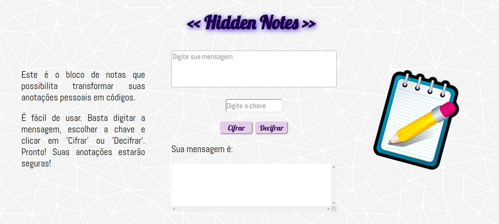

# << Hidden Notes >>

## Sobre a página

A ideia de "Hidden Notes" é que o usuário possa fazer anotações como em um bloco de notas.
É comum termos anotado lembretes, endereços e senhas, mas ninguém gosta de alguém 'fuçando' nossas coisas, não é mesmo?!

A aplicação permite transformar as anotações em códigos. Somente quem possuir a chave consegue ler as anotações. 

O projeto foi baseado na Cifra de César.

## O que é a Cifra de César?

Cifrar significa codificar. A [cifra de
César](https://pt.wikipedia.org/wiki/Cifra_de_C%C3%A9sar) é uma das técnicas mais simples de cifrar uma mensagem e é um dos primeiros tipos de criptografias conhecidas na história. O imperador romano Júlio César
utilizava essa cifra para enviar ordens secretas aos seus generais no campo de batalha.

É um tipo de cifra por substituição, em que cada letra do texto original é substituida por outra que se encontra há um número fixo de posições (deslocamento) mais a frente do mesmo alfabeto.

## O Projeto

### Definição do produto

A interface permite ao usuário:

* Inserir uma mensagem (texto) para ser cifrada ou decifrada.
* Eleger um _offset_ indicando quantas posições de deslocamento de caracteres  quer que a cifra utilize.
* Ver o resultado da mensagem cifrada ou decifrada.

### Scripts / Arquivos

* `HTML:` contém a marcação HTML e chama o CSS e JavaScript necessários. 
Foram criados 1 textarea para inserir o texto e 3 inputs, 1 tipo 'number' para inserir a chave de deslocamento e 2 tipo 'button' para cifrar e decifrar as mensagens.

* `JavaScript:` foram criados dois arquivos .js, o primeiro apenas para chamar os eventos DOM e o segundo, executando as funções 'cifrar' e 'decifrar'. Foi utilizado fluxo condicional 'if...else' para que fossem consideradas letras maiúsculas, minúsculas e, também, números e outros caracteres.

* `CSS:` para dar estilo ao html, foi criado um arquivo css, onde chamamos os elementos para estilizar cada parte do html.

### Layout da página

